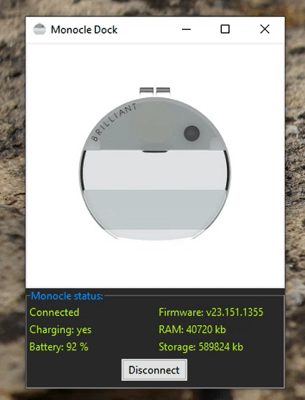

### About

This desktop app is for my main computer. It is paired with the magnetic usb charging below with the pemeranent [clip mod](https://github.com/jdc-cunningham/bl-monocle-stuff/tree/master/3d-printing/glasses-permanent-clip).

Primarily I am interested in whether the device is charging or not but I have also included other data.

### Made with Python Bleak and Tkinter

I have wrapped the [uart_service.py](https://github.com/hbldh/bleak/blob/develop/examples/uart_service.py) example from Bleak and I'm using it as a polling thread to pick up commands sent to the Monocle.

### Requires `main.py` on Monocle

For this code to work, you need [this code](monocle_main.py) flashed onto the Monocle. It provides a helper function that grabs all the different statuses eg. battery level to display on the dock.

### App flow

There are two main files:
- [main.py](app/main.py)
- [bluetooth.py](app/bluetooth/bluetooth.py)

In `main.py` the desktop UI (dock) is built up then the app logic `start_ble` is started as a thread. In `start_ble` the connection/listener loop thread for the monocle bluetooth is started. Then the app logic `run_app`starts. At this point the dock has rendered and the monocle is either connected or it isn't. The dock will continue to try and connect to the monocle (since monocle can only be connected to one thing at a time). The connect/disconnect button is there for manual control.

Closing the dock app (top-right X) should stop any related threads that were spawned by this app.

### Making an executable

This uses [pyinstaller](https://www.tutorialspoint.com/converting-tkinter-program-to-exe-file) to make an exe. Otherwise you can just run the app using `$python main.py`.

`$python -m PyInstaller -F main.py --name=MonocleDock --windowed`

Note: the paths of the images have to be set in `MonocleDock.spec` which is produced the first time you run the above file

### Disclaimer

This does not consider large text being sent to the Monocle eg. entire scripts.
