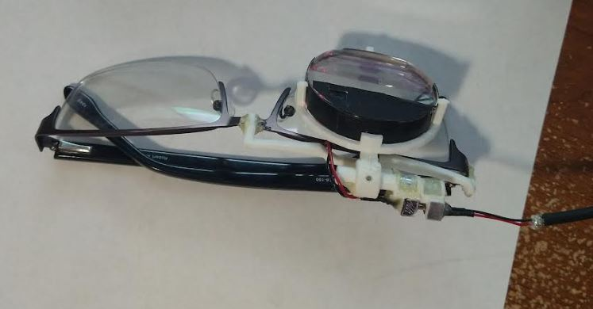
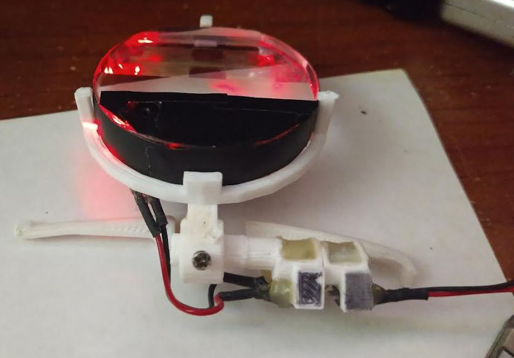

### About

This is intended to be a little desktop app that I can check/make sure the monocle is always ready.

I have modified my monocle for USB charging so that it's just ready to be worn like glasses.

I don't have to pull the monocle out of the case/align it... it's fixed in place to my spare set of glasses.

Initially I was trying to have a while loop in the `main.py` file that checked for charging status but after running into issues I just went with script-based checking (eg. this app).

### Bleak info

1) find the monocle (has to not be connected), says "monocle" in device string
2) enumerate the response of `client.get_services()` one should be Nordic UART Service
3) use this uuid for repl

#### Current monocle clip

Notice I took the screw out, it had a tendency to lift the monocle. The monocle is clearest when it is closest to the glasses/not rotated (due to prism design).

Also the camera is on the same plane as the face of the monocle so it ideally is perpendicular to the ground or close to that.

#### Monocle clip being reworked

